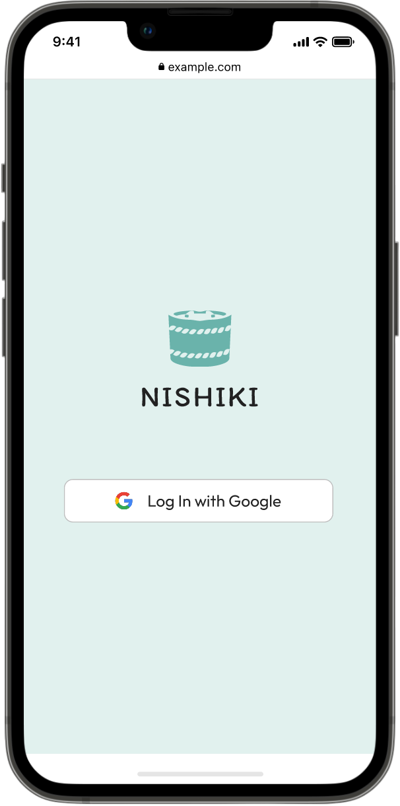
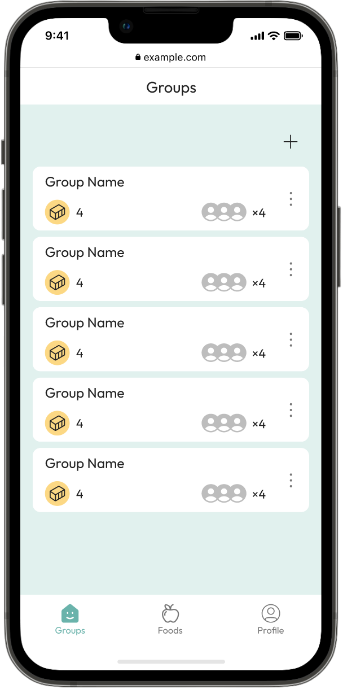
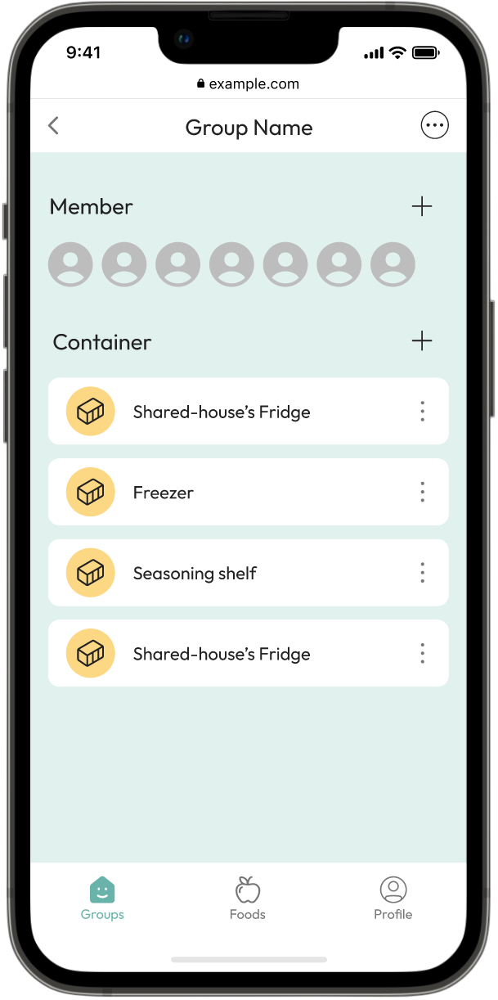

  <picture>
    <source media="(prefers-color-scheme: light)" srcset="./src/assets/images/logos/logo_horizontal_primary_black_text.svg" />
    <source media="(prefers-color-scheme: dark)" srcset="./src/assets/images/logos/logo_horizontal_primary_white_text.svg" />
    
  </picture>

 

<strong>An app for tracking and sharing food inventories within groups for better pantry management.</strong>

Nishiki simplifies group food management by offering features for tracking, categorizing, and sharing food inventories, ensuring that households, roommates, and friends can seamlessly coordinate grocery shopping and pantry organization, leading to smarter consumption and less waste.

 

  
  
  
  

 

## Repository Structure

Nishiki is composed of three main repositories, each serving a unique purpose within the application's ecosystem:

<table>
  <tr>
    <th>Repository</th>
    <th>Description</th>
  </tr>
  <tr>
    <td><a href="https://github.com/nishiki-tech/nishiki-frontend" target="_blank"><strong>nishiki-frontend</strong></a></td>
    <td><strong>This repository.</strong> It hosts the front-end code that shapes the app's user interface and interaction design.</td>
  </tr>
  <tr>
    <td><a href="https://github.com/nishiki-tech/nishiki-backend" target="_blank"><strong>nishiki-backend</strong></a></td>
    <td>Contains all back-end and infrastructure code, covering server logic, database operations, and API services.</td>
  </tr>
  <tr>
    <td width="200px"><a href="https://github.com/nishiki-tech/nishiki-documents" target="_blank"><strong>nishiki-documents</strong></a></td>
    <td>Maintains GUI documentation code, including a project guide developed with Docusaurus and a Web API specification using OpenAPI.</td>
  </tr>
</table>
  
## Tech Stack

- Language: [TypeScript](https://www.typescriptlang.org/)
- Framework: [Next.js 14](https://nextjs.org/) (with [App Router](https://nextjs.org/docs/app))
- Styling: [Tailwind CSS](https://tailwindcss.com/)
- Components: [shadcn/ui](https://ui.shadcn.com/) ([Radix UI](https://www.radix-ui.com/primitives))
- Form Handling: [Zod](https://zod.dev/), [React Hook Form](https://react-hook-form.com/)
- Linting/Formatting: [ESLint](https://eslint.org/), [Prettier](https://prettier.io/), [Commitlint](https://commitlint.js.org/)
- Testing: [Jest](https://jestjs.io/)
- Authentication: [Amazon Cognito](https://aws.amazon.com/cognito/), [AWS Amplify](https://aws.amazon.com/amplify/)
- CI/CD: [GitHub Actions](https://github.com/features/actions), [Vercel](https://vercel.com/docs)
- Monitoring: [Vercel](https://vercel.com/docs)

## Getting Started

Please refer to the [Setup Documentation](./docs/SETUP.md) for instructions on how to set up the development environment locally.

## Community

The Nishiki community can be found on [GitHub Discussions]() where you can ask questions, voice ideas, and share your projects with other people.

To chat with the team or other community members, you can join the Nishiki [Discord](https://discord.gg/kZ9kZE8dcP) server.

Do note that our [Code of Conduct](./docs/CODE_OF_CONDUCT.md) applies to all Nishiki community channels. Users are highly encouraged to read and adhere to them to avoid repercussions.

## Contributing

If you are interested in contributing to Nishiki, please refer to the [Contributing Guidelines](./docs/CONTRIBUTING.md) for more information.

We are looking for contributors who can actively contribute to this project. If you are interested, please feel free to reach out to us.

### Good First Issues:

We have a list of [good first issues](https://github.com/nishiki-tech/nishiki-frontend/issues?q=is%3Aissue+is%3Aopen+sort%3Aupdated-desc+label%3A%22good+first+issue%22) that contain issues that are relatively easy to solve and are a good starting point for newcomers.

 

## Authors

<table>
  <tr>
    <td width="80px" align="center">
      
    </td>
    <td><strong>Kota Kawaguchi</strong></td>
    <td><a href="https://github.com/kotaaaa" target="_blank">@kotaaaa</a></td>
  </tr>
    <tr>
    <td width="80px" align="center">
      
    </td>
    <td width="200px"><strong>Nick Y. Ito</strong></td>
    <td width="200px"><a href="https://github.com/nick-y-ito" target="_blank">@nick-y-ito</a></td>
  </tr>
  <tr>
    <td width="80px" align="center">
      
    </td>
    <td><strong>Kanta Sakai</strong></td>
    <td><a href="https://github.com/kanta1207" target="_blank">@kanta1207</a></td>
  </tr>
  <tr>
    <td width="80px" align="center">
      
    </td>
    <td><strong>Shuhei Ota</strong></td>
    <td><a href="https://github.com/ShoeheyOt" target="_blank">@ShoeheyOt</a></td>
  </tr>
</table>

 

<!-- TODO: Add License Section -->
<!-- ISSUE: #233 -->
<!-- ## License -->
