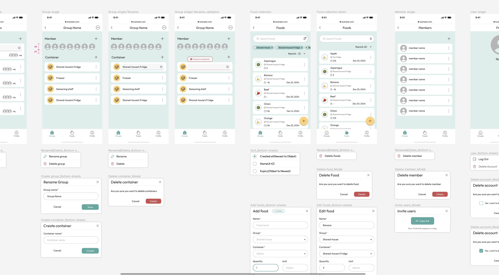

# Contributing to Nishiki

Thank you for your interest in contributing to Nishiki! This document outlines the guidelines for contributing to this project.

## Getting Started

Please follow the [Setup Documentation](./SETUP.md) for instructions on how to set up the development environment locally.

## Directory Structure

Please follow the [Directory Structure Documentation](./DIRECTORY_STRUCTURE.md).

## Code Style

Please follow the [Code Style Documentation](./STYLEGUIDE.md).

## Branching Schemes

Please follow the [Branching Schemes Documentation](./BRANCHING.md).

## Testing

Please follow the [Testing Documentation](./TESTING.md).

## Commit Convention

Please follow the [Commit Convention Documentation](./COMMITS.md).

## Pull Requests

Please follow the [Pull Requests Documentation](./PULL_REQUESTS.md).

## Figma Design

We have a Figma design for this project. You can access the design by clicking [here](https://www.figma.com/file/m0DaNrd0yXWbY4Dy7cuZiN/Nishiki-project?type=design&node-id=0%3A1&mode=design&t=GM3r2IR7DjiYbxXF-1). Please follow the design when you are working on the project.

